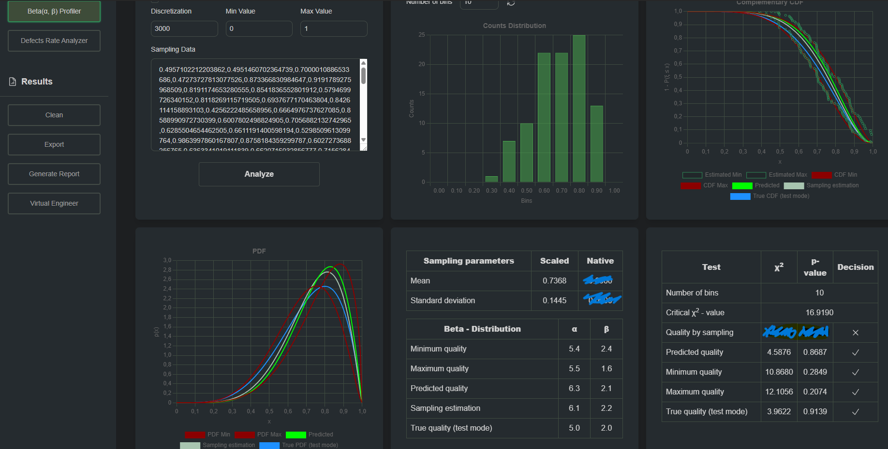

# Quality Control Room

Quality control tool for industrial production and inspection processes. Personal project developed in spare time.

### Live Demo: [https://quality-control.io](https://quality-control.io)

### Quick Start
1. Open [https://quality-control.io/tools/beta-profile](https://quality-control.io/tools/beta-profile)
2. Click the **"Analyze"** button
3. Test mode is already checked, so the system will process test data and show results as in the following picture:


*Example analysis results in test mode showing the hybrid ML + statistical approach in action*

(some features in the dashboard are under construction)

## Overview

Hybrid approach combining classical statistical methods with machine learning for manufacturing quality control.

## Key Features

### Classical Statistical Methods
- Traditional statistical process control (SPC) metrics
- Control charts and process capability analysis
- Standard quality control calculations and measurements

### Machine Learning Enhanced Approach
- **Hybrid ML + Statistical Method**: Combines machine learning with statistical analysis
- **No Normality Assumption Required**: Works with any data distribution
- **Small Sample Optimization**: Effective with limited sample sizes
- **Improved Accuracy**: Equal or better performance than traditional methods

## Advantages

* Works with small sample sizes  
* No normality assumption required  
* Combines statistical reliability with ML power  
* Production-ready  

## Project Structure

```
├── engine/          # Core Rust-based processing engine
├── doc/             # Documentation (under construction!)
├── ui/              # Vue.js web interface
├── data/            # Sample data and configuration files
├── xgbwrapper/      # C wrapper for XGBoost integration
└── systemd/         # System service configuration
```

## Technology Stack

- **Backend Engine**: Rust (high-performance computing)
- **Machine Learning**: XGBoost with custom C wrapper
- **Frontend**: Vue.js with Tailwind CSS
- **Deployment**: Systemd service integration

**Yes, there's life beyond Python!** 😄

## Current Status

**Under Active Development**

Core ML + statistical methodology is functional. Full feature set in progress.

### What's Working
- Core ML + statistical analysis engine
- Basic web interface for continuous tools (Beta distribution approximation)
- XGBoost integration for distribution parameter predictions
- Sample data processing capabilities (most useful statistical metrics)

### Planned Features
- More tools for normal approximation and discrete parameters
- Extended statistical method library
- Advanced visualization tools
- Industrial IoT integration
- Comprehensive reporting system
- LLM agent "Virtual Engineer" to help with results interpretation and report generation
- Multi-language support

## Documentation

In progress. Will include:
- Methodology explanation
- API reference
- Usage examples
- Comparison studies with traditional methods

## Getting Started

Installation and setup instructions coming soon.

## License

See [LICENSE](LICENSE) file for details.

## Contact

For questions and suggestions:

- **LinkedIn**: [Vasilii Piiadov](https://www.linkedin.com/in/vasilii-piiadov/)
