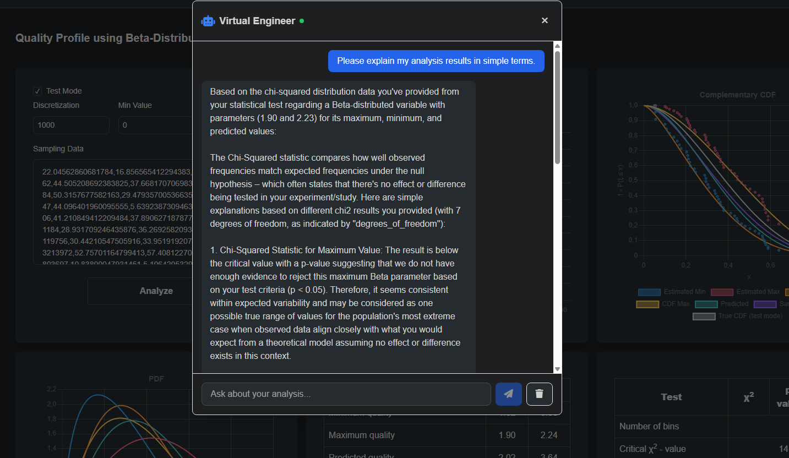

# Quality Control Room

Quality control tool for industrial production and inspection processes. Personal project developed in spare time.

### Quick Start
1. Open [https://quality-control.io/tools/beta-profile](https://quality-control.io/tools/beta-profile)
2. Click the **"Analyze"** button
3. Test mode is already checked, so the system will process test data and show results as in the following picture:


*Example analysis results in test mode showing the hybrid ML + statistical approach in action*

(some features in the dashboard are under construction)

### Live Demo: 
[https://quality-control.io](https://quality-control.io)

## Overview

Hybrid approach combining classical statistical methods with machine learning for manufacturing quality control.

## 🤖 Virtual Engineer

> ⚠️ **Note:** Virtual Engineer works now, but it is veeeery slooooow because of my cheap VPS where it is running. And for a while verbose and stupid. I continue to work on that, be patient, please! 😄

The **Virtual Engineer** is an AI-powered chat assistant integrated into the application. It helps you understand your quality control analysis results by providing explanations, answering questions about the methodology, and suggesting actions based on your data.


*AI assistant explaining analysis results in real-time*

**Features:**
- Contextual understanding of your current analysis
- Explains statistical parameters in plain language
- Answers questions about chi-square tests, distribution fitting, and quality metrics
- Suggests actionable next steps based on results
- Powered by local LLM (Ollama) - no data leaves the server

## Theoretical Foundation

### Problem Statement

Given:
- A finite population of **N** items (e.g., a production batch)
- Each item has a quality parameter **x** (e.g., humidity, weight, dimension)
- The quality parameter follows some distribution (Beta or Normal)
- We can only afford to sample **k** items from the batch

**Goal:** Estimate the true distribution parameters (α, β) or (μ, σ) from k samples and provide confidence bounds on these estimates.

### Hypergeometric Sampling Model

When sampling k items without replacement from a population of N items containing K "successes" (items meeting some criterion), the number of successes in the sample follows a hypergeometric distribution:

$$P(X = x) = \frac{\binom{K}{x} \binom{N-K}{k-x}}{\binom{N}{k}}$$

### Order Statistics Interpretation

When we sort k sampled values, each order statistic X₍ᵢ₎ provides information about the underlying distribution:

| Order Statistic | Interpretation | Quality Interval |
|-----------------|----------------|------------------|
| X₍₁₎ (smallest) | ~(k) successes "above" this value | HIGH survival prob |
| X₍₂₎ | ~(k-1) successes "above" | slightly lower |
| ... | ... | ... |
| X₍ₖ₎ (largest) | ~(1) success "above" this value | LOW survival prob |

### Why This Works

1. **Quality Intervals** map each observation to confidence bounds on population proportions
2. **Survival Function** S(x) = 1 - F(x) directly represents "proportion of population above threshold x"
3. **CDF Fitting** via Nelder-Mead optimization finds distribution parameters matching the bounds
4. **XGBoost** learns to map the uncertainty envelope (min/max fits) to true parameters

### Key Mathematical Properties

- **Monotonicity**: Quality interval bounds form monotonically decreasing sequences matching survival CDFs
- **4 Features from 2 Bounds**: Fitting both cdf_min and cdf_max captures uncertainty
  - cdf_min fit → conservative (lower bound) estimate
  - cdf_max fit → optimistic (upper bound) estimate

## Key Features

### Classical Statistical Methods
- Traditional statistical process control (SPC) metrics
- Control charts and process capability analysis
- Standard quality control calculations and measurements

### Machine Learning Enhanced Approach
- **Hybrid ML + Statistical Method**: Combines machine learning with statistical analysis
- **No Normality Assumption Required**: Works with any data distribution
- **Small Sample Optimization**: Effective with limited sample sizes
- **Improved Accuracy**: Equal or better performance than traditional methods

## Advantages

* Works with small sample sizes  
* No normality assumption required  
* Combines statistical reliability with ML power  
* Production-ready  

## Project Structure

```
├── engine/              # Rust workspace for backend services
│   ├── server/          # WebSocket API server (port 8081)
│   └── tests/           # Integration tests
├── engineer/            # Virtual Engineer AI service (port 8082)
├── models/              # Pre-trained XGBoost models (.xgb files)
├── models_gen/          # Python: model training & data generation
│   ├── THEORY.md        # Detailed mathematical foundation
│   └── src/             # Training scripts
├── ui/                  # Vue.js web interface
├── doc/                 # Documentation and images
├── data/                # Sample data and configuration
├── xgboost/             # XGBoost library source
├── xgbwrapper/          # C wrapper for XGBoost integration
├── lib/                 # Compiled shared libraries
└── systemd/             # Service configuration files
```

## Technology Stack

- **Backend Engine**: Rust with Axum (high-performance WebSocket server)
- **Machine Learning**: XGBoost with custom C wrapper (libxgbwrapper)
- **AI Assistant**: Ollama with phi3:mini model (local LLM)
- **Frontend**: Vue.js 3 + Vite + Tailwind CSS
- **Model Training**: Python with scipy, numpy
- **Deployment**: Systemd services, Let's Encrypt TLS

**Yes, there's life beyond Python!** 😄

## Current Status

**Under Active Development**

Core ML + statistical methodology is functional. Full feature set in progress.

### What's Working
- Core ML + statistical analysis engine
- Basic web interface for continuous tools (Beta distribution approximation)
- XGBoost integration for distribution parameter predictions
- Sample data processing capabilities (most useful statistical metrics)
- **Virtual Engineer AI assistant** for results interpretation

### Planned Features
- More tools for normal approximation and discrete parameters
- Extended statistical method library
- Advanced visualization tools
- Industrial IoT integration
- Comprehensive reporting system
- Virtual Engineer improvements (faster responses, smarter context)
- Multi-language support

## Documentation

- [THEORY.md](models_gen/THEORY.md) - Complete mathematical foundation
- [tech_doc.md](doc/tech_doc.md) - Technical documentation
- [BUILD_INSTRUCTIONS.md](BUILD_INSTRUCTIONS.md) - Build and deployment guide

## Getting Started

Installation and setup instructions coming soon.

## License

See [LICENSE](LICENSE) file for details.

## Contact

For questions and suggestions:

- **LinkedIn**: [Vasilii Piiadov](https://www.linkedin.com/in/vasilii-piiadov/)
